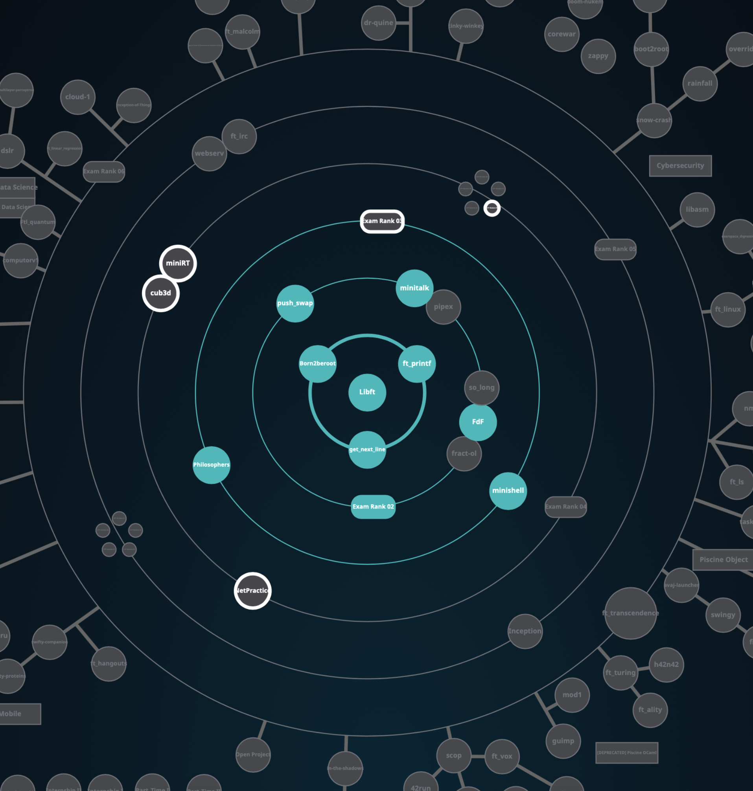

# 42-Cursus

My project submissions for the 42 cursus @ 42 Adelaide:

N.B. Projects are either SOLO projects or GROUP projects, and the hours mentioned are the 
estimated standard workloads for each respective project.

🪐 **RING 0 - 1 PROJECT --> COMPLETED** ✅

    ✅ Ring 0 - Libft (SOLO, about 70 hours)

        "The very first project as a student at 42. The object of the project is to recode 
        functions of the C standard library as well as some other utility functions that will be 
        used during the whole cursus"

🪐 **RING 1 - 3 PROJECTS --> COMPLETED** ✅✅✅

    ✅ Ring 1 - Born2beroot (SOLO, about 40 hours)

        "This project aims to introduce you to the wonderful world of virtualization." 

    ✅ Ring 1 - ft_printf (SOLO, about 70 hours)

        "This project is pretty straightforward, you have to recode printf. You will learn what 
        is and how to implement variadic functions. Once you validate it, you will reuse this 
        function in your future projects" 

    ✅ Ring 1 - get_next_line (SOLO, about 70 hours)

        "May it be a file, stdin, or even later a network connection, you will always need a way
        to read content line by line. It is time to start working on this function, which will be 
        essential for your future projects."

🪐 **RING 2 - 3 PROJECTS + 1 EXAM --> COMPLETED** ✅✅✅✅

    ✅ Ring 2 - FdF (SOLO, about 60 hours)

        "All programs that you wrote until now were executed in text mode on your terminal. Now, 
        let’s discover something more exciting: how to open a graphics window and draw inside? To
        start your journey in graphic programming, FdF offers to represent “iron wire” meshing in 
        3D." 

    ✅ Ring 2 - minitalk (SOLO, about 50 hours)

        "The purpose of this project is to code a small data exchange program using UNIX signals. 
        It is an introductory project for the bigger UNIX projects that will appear later on in the
        cursus." 

    ✅ Ring 2 - push_swap (SOLO, about 60 hours)

        "This project involves sorting data on a stack, with a limited set of instructions, and 
        the smallest number of moves. To make this happen, you will need to manipulate various 
        sorting algorithms and choose one of the most appropriate solution(s) for optimised data 
        sorting." 

    ✅ Ring 2 - Exam Rank 02

🪐 **RING 3 - 2 PROJECTS + 1 EXAM --> IN PROGRESS** ✅✅⏳

    ✅ Ring 3 - minishell (GROUP, about 210 hours)

        "The objective of this project is for you to create a simple shell." 

    ✅ Ring 3 - Philosophers (SOLO, about 70 hours)

        "Eat, Sleep, Spaghetti, repeat. This project is about learning how threads work by precisely 
        timing a group of philosophers on when to pick up forks and eat spaghetti without dying from 
        hunger." 

    ⏳ Ring 3 - Exam Rank 03

🪐 **RING 4 - 2 PROJECTS + 1 EXAM --> IN PROGRESS** ✅✅⏳
